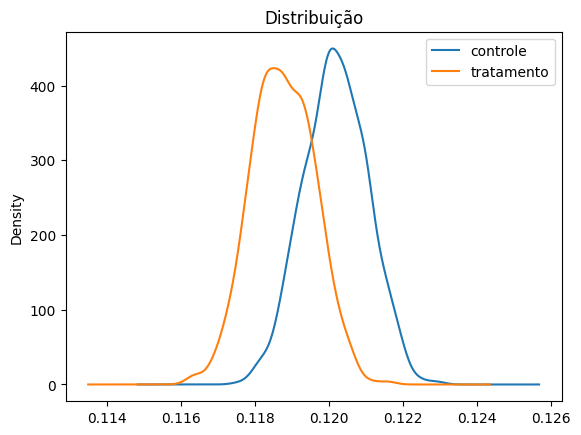
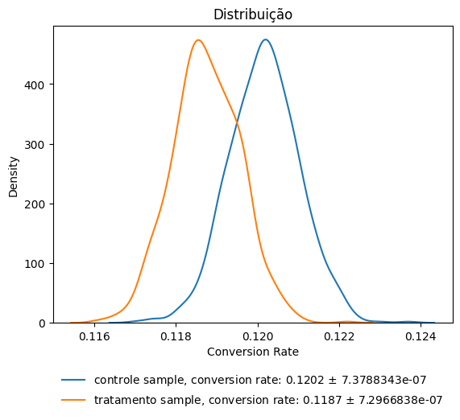

# Análise de teste AB
Nesse pequeno projeto serão utilizados os dados disponíveis no Kaggle, onde temos dados de um teste AB realizado entre 2 variações de uma landing page em um site confidencial. Para tornar o problema mais tangível, irei criar uma hipótese imaginária para tornar essa análise mais tangível. Então, suponhamos que recebemos a seguinte demanda do nosso product manager:

### Definição do Problema
```
Olá, Matheus! 
Estou escrevendo para você hoje para discutir uma hipótese para um teste A/B em uma landing page do nosso site.
A minha hipótese é que adicionar uma prova social à landing page aumentará a taxa de conversão.

Para testar essa hipótese, criarei duas versões da landing page: uma com uma prova social e outra sem. Vou distribuir as duas versões da landing page para um subconjunto dos nossos visitantes e comparar as taxas de conversão entre as duas versões.

Espero que a versão da landing page com a prova social tenha uma taxa de conversão mais alta do que a versão sem. Isso ocorre porque a prova social é uma forma de mostrar aos visitantes que outras pessoas já compraram o produto e gostaram dele. Isso pode ajudar a construir confiança e credibilidade com os visitantes, e fazê-los mais propensos a comprar também.

Aqui está um exemplo de como eu usaria a prova social nessa landing page:
"98% dos nossos clientes estão satisfeitos com o nosso produto."
"O nosso produto foi recomendado pela Forbes, a CNN e a The New York Times."
"Temos mais de 1 milhão de clientes satisfeitos."
Acredito que a prova social pode ser uma ferramenta poderosa para melhorar as taxas de conversão. Estou animado para testar essa hipótese e ver os resultados.
```

Bom, agora é a hora de destacar o que temos até então:

**Hipótese:**
Adicionar uma prova social à landing page aumentará a taxa de conversão.

**Teste:**
Vamos criar duas versões da landing page: uma com uma prova social e outra sem. Vamos distribuir as duas versões da landing page para um subconjunto de nossos visitantes e comparar as taxas de conversão entre as duas versões.

**Ganho esperado:**
Esperamos que a versão da landing page com a prova social tenha uma taxa de conversão mais alta do que a versão sem. Isso ocorre porque a prova social é uma forma de mostrar aos visitantes que outras pessoas já compraram o produto e gostaram dele. Isso pode ajudar a construir confiança e credibilidade com os visitantes, e fazê-los mais propensos a comprar também.


### Etapas:
- Definição do problema ✅
- Análise inicial dos dados ✅
- Entendimento das populações ✅
- Preparação dos dados ✅
- Teste de SRM (Sample Ratio Missmatch), para detectar possíveis problemas com a distribuição das populações do teste. ✅
- Testes estatístico para validar ou invalidar a hipótese inicial ✅
- Análise dos resultados 

### Análise e conclusões
#### 1. Entendimento dos dados
De início, vamos entender como os dados estão dispostos.
A tabela possui os seguintes campos:
```
Nome do dataframe: ab_df
 #   Column        Non-Null Count   Dtype  Descrição
---  ------        --------------   ----- 
 0   user_id       294478 non-null  int64  Representa o id único do usuário 
 1   timestamp     294478 non-null  object timestamp do momento do acesso do usuário
 2   group         294478 non-null  object grupo de segmentação do teste, podendo ser teste ou controle (treatment / control)
 3   landing_page  294478 non-null  object representa a landing page apresentada ao usuário, dado que é dependente do grupo em que ele se encontra
 4   converted     294478 non-null  int64  valor binário que informa se o usuário converteu ou não (1 ou 0)
```
Tamanho: (294478 linhas, 5 colunas)

Usando a função `ab_df.duplicated().sum()` temos 0 linhas duplicadas

Analisando os dados de maneira geral, estamos interessados em verificar se houve ou não um ganho na taxa de conversão da variante do tratamento, vamos observar em linhas gerais como está disposta a taxa de conversão em cada grupo e no geral.

```
Conversion Rate Geral:  0.1197
Conversion Rate Controle:  0.1204
Conversion Rate Tratamento:  0.1189
```

Anteriormente checamos se não havia nenhuma linha duplicada, agora vamos checar se não houve vazamento ou duplicação de usuários, já que 1 usuário só pode estar em 1 dos dois grupos (teste ou controle) e além disso, a modelagem de nossa tabela faz com que cada linha represente apenas um usuário, portanto vamos remover os usuários duplicados.

#### 2. Limpeza e preparação dos dados

`ab_df['user_id'].duplicated().sum()`
`ab_df['user_id'].duplicated().sum() / len(ab_df)`

Temos 3894 usuários duplicados em nosso dataset, representando cerca de 1,3% do total. Por conta do baixo volume e não termos acesso as regras de negócio/buckets que foram utilizadas no dataset disponibilizado, optei por remover esses usuários e criar um novo dataset sem eles.

```
### Cria lista com usuários duplicados (user_id)
ids_duplicados = ab_df['user_id'].value_counts().sort_values()

### Cria uma lista com os user_id com > 1 ocorrência
ids_duplicados = ids_duplicados[ids_duplicados.values > 1].index 

### Cria novo dataframe sem os usuários duplicados
ab_df_uniques = ab_df[ab_df["user_id"].isin(ids_duplicados) == False]

### Remove colunas desnecessárias para o teste
ab_df_uniques = ab_df_uniques.drop(columns="timestamp")`
```

#### 3. Teste de Sample Ratio Missmatch
Sample Ratio Mismatch, acontece em testes de hipóteses quando as amostras comparadas têm proporções diferentes entre os grupos, no nosso caso controle e tratamento. Isso pode afetar a validade dos resultados do teste. Por isso, é importante garantir que as amostras estejam balanceadsa e sejam representativas para obter conclusões confiáveis.

Para garantir que essas proporções estão balanceadas utilizarei a função que `Srm_test` que utiliza o qui-quadrado para medir se essa relação entre as amostras causa um impacto significativo no experimento:

```
# Roda a função para verificar o desbalanço entre grupos (Sample Ratio Missmatch)
srm_test(control_count, treatment_count, 0.005)

```
Diff. Entre Buckets: 104 usuários\
Ratio: 0.9993\
Chi-square: 0.0377\
P-value: 0.8460\
O teste é válido: valor-p > 0.005.


#### 4. Testes estatísticos
Vou utilizar duas abordages para exemplicação (bootstrap e baesyiana):

#### 4.1 Bootstrap
O método Bootstrap é uma técnica estatística de reamostragem com reposição que permite realizar inferências sobre uma população sem assumir uma distribuição específica para os dados. 

Utilizando as funções criadas:

```
bootstrap_ab_test(ab_df_uniques) # função que roda o teste de bootstrap e plota o gráfico normalizado
calculate_ci(ab_df_uniques, "group", "converted") # função que calcula o intervalo de confiança

```


\

Bootstrap Diferença Observada: -0.0014\
Intervalo de confiança: [-0.00374671  0.001125  ]\
p-value: 0.5200\
Os grupos NÃO posuem conversões estatisticamente diferentes.\
```
Group	     Mean Conversion Rate	Confidence Interval
control	     0.1202	                [0.1185 (-1.40%), 0.1219 (1.40%)]
treatment    0.1187	                [0.1171 (-1.41%), 0.1204 (1.41%)]
```


#### 4.1 Bayes 
A abordagem Bayesiana para testes A/B é uma maneira alternativa de realizar experimentos e análises comparativas entre grupos, com base na teoria da probabilidade Bayesiana. Ao contrário dos métodos frequentistas tradicionais, que se concentram em valores pontuais e limites de confiança, a abordagem Bayesiana considera a incerteza dos parâmetros em termos de distribuições de probabilidade.

Utilizando as funções criadas:
```
# Calcula o beta para os buckets
beta_C = beta(ab_df_uniques[ab_df_uniques['group'] == 'control']['converted'].sum() + 1, (1 - ab_df_uniques[ab_df_uniques['group'] == 'control']['converted']).sum() + 1)
beta_T = beta(ab_df_uniques[ab_df_uniques['group'] == 'treatment']['converted'].sum() + 1, (1 - ab_df_uniques[ab_df_uniques['group'] == 'treatment']['converted']).sum() + 1)

#Calculando o ganho do tramtamento
lift=(beta_T.mean()-beta_C.mean())/beta_C.mean()

#Calcula a probabilidade estatística do ganho visto no tste
prob=calc_prob_between(beta_T, beta_C)

bayesian_plot([beta_C, beta_T], names=["controle", "tratamento"], data=ab_df_uniques, group_column='group', converted_column='converted', linf=0.1, lsup=0.14)

# Printa o resultado
if lift < 0:
    print (f"O Tratamento teve um efeito de {lift*100:2.2f}% na métrica selecionada com {prob*100:2.1f}% de probabilidade de perder para o controle.")
else:
    print (f"O Tratamento teve um efeito de {lift*100:2.2f}% na métrica selecionada com {prob*100:2.1f}% de probabilidade de ganhar do controle.")
                

```

O Tratamento teve um efeito de -1.20% na métrica selecionada com 11.6% de probabilidade de perder para o controle.

#### 5. Conclusões
Não conseguimos provar que o tratamento teve um efeito estatísticamente válido em relação ao grupo de controle, portanto podemos afirmar que não há diferença entre os grupos e que a landing page nova não traz uma melhora significativa na métrica selecionada (conversão).

### Referências
[Trustworthy Online Controlled Experiments: A Practical Guide to A/B Testing - Ron Kohavi (Author), Diane Tang (Author), Ya Xu (Author)](https://www.amazon.com/Trustworthy-Online-Controlled-Experiments-Practical-ebook/dp/B0845Y3DJV)
[Detecting and avoiding bucket imbalance in A/B tests - Twitter Engineering Blog](https://blog.twitter.com/engineering/en_us/a/2015/detecting-and-avoiding-bucket-imbalance-in-ab-tests)
[Bayesian AB Test with Python](https://towardsdatascience.com/bayesian-a-b-testing-with-python-the-easy-guide-d638f89e0b8a)
